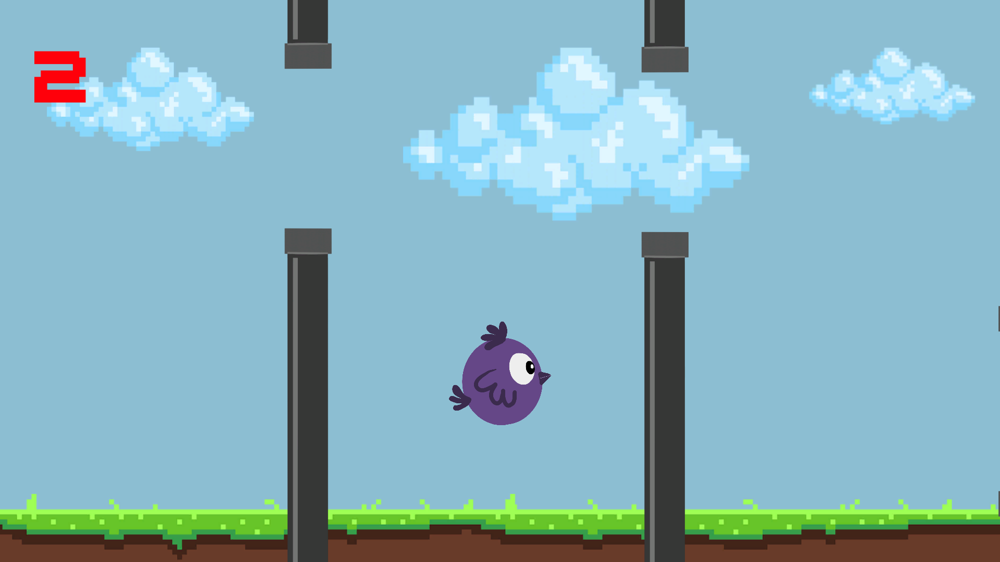
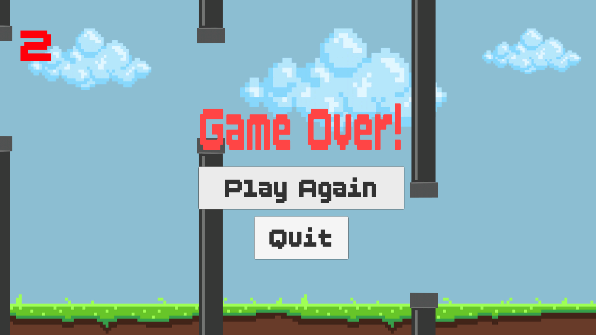

# 🐦 Flappy Bird Clone

A simple Flappy Bird clone developed with Unity 2D to practice core game development concepts including physics, collision detection, UI systems, and scene management.

---

## 🎮 Gameplay

Control the bird and fly through randomly generated pipe obstacles.

Try to survive as long as possible and achieve the highest score.

### Controls

| Action | Key |
|----------|----------|
| Jump | Space |

---

## 📸 Screenshots

### Gameplay

<p align="center">
  
</p>

### Game Over Screen

<p align="center">
  
</p>

---

## ✨ Features

- Physics-based Bird Movement
- Random Pipe Generation
- Score System
- Game Over Screen
- Restart Functionality
- Collision Detection
- Clean Pixel Art Visual Style

---

## 🛠 Technologies Used

- Unity 2D
- C#
- Rigidbody2D Physics
- Unity UI System
- Scene Management

---

## 📂 Project Structure

```text
Assets
├── Scripts
│   ├── BirdScript
│   ├── LogicScript
│   ├── PipeSpawnerScript
│   ├── PipeMoveScript
│   └── PipeMiddleScript
├── Prefabs
├── Scenes
├── Sprites
└── UI
```

---

## 🧠 Script Overview

### BirdScript

Responsible for:

- Bird movement
- Jump input
- Collision detection
- Game Over triggering

### PipeSpawnerScript

Responsible for:

- Pipe spawning
- Random pipe height generation

### PipeMoveScript

Responsible for:

- Pipe movement
- Destroying off-screen pipes

### PipeMiddleScript

Responsible for:

- Score detection
- Preventing score increase after Game Over

### LogicScript

Responsible for:

- Score management
- Game Over screen
- Restart system
- General game flow

---

## 🔄 Gameplay Flow

```text
Player Presses Space
        ↓
Bird Jumps
        ↓
Pass Through Pipes
        ↓
Increase Score
        ↓
Avoid Obstacles
        ↓
Game Over on Collision
```

---

## 🚀 Future Improvements

- High Score Saving
- Sound Effects
- TextMeshPro UI
- Pause Menu
- Difficulty Scaling
- Mobile Support
- Object Pooling
- Multiple Background Themes

---

## 🎯 Learning Goals

This project was built to practice:

- Unity 2D Development
- C# Programming
- Rigidbody2D Physics
- Collision Detection
- UI Systems
- Scene Management

---

## 👨‍💻 Author

Created by **SeMteX1h**

GitHub:
https://github.com/SeMteX1h